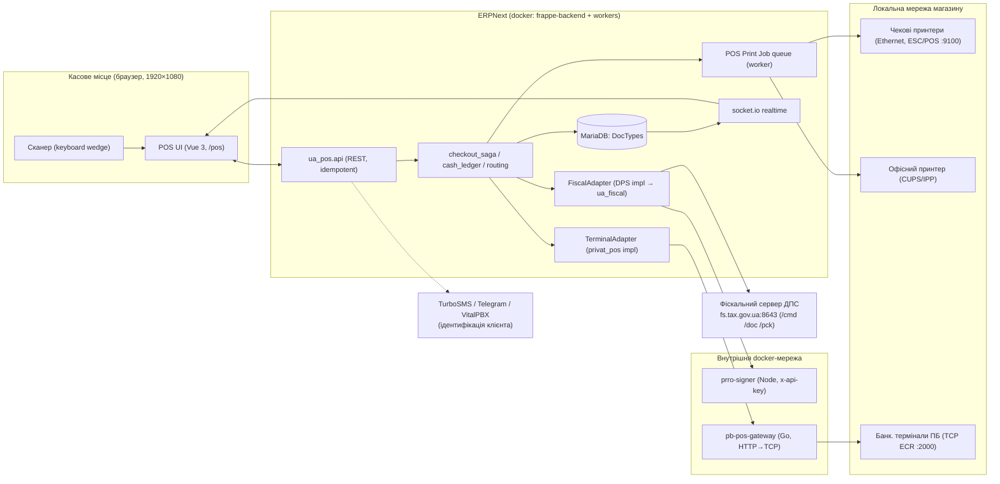
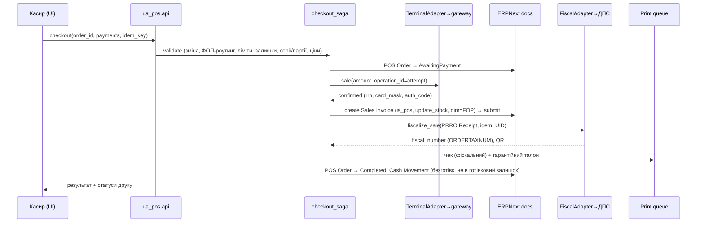

# 02 — Архітектура рішення

## 1. Аналіз існуючих репозиторіїв і місце POS

### erpnext_ua (модулі `ua_fop`, `ua_fiscal`)
Локалізаційна апка з готовим фундаментом: FOP Profile (валідований РНОКПП, групи ЄП, IBAN),
UA Tax Parameters + income_monitor (ліміти ЄП), податковий календар, ПРРО-каркас
(PRRO Settings/Cash Register/Shift/Receipt, UA KEP Key, fiscal_client до API ДПС, xml_builder check01,
offline_fiscal), друкформи UA. Hooks мінімальні (scheduler + install) — конфліктів немає.

### erpnext_ukraine_integrations
Апка-конектор: monobank/privatbank/liqpay,
TurboSMS, VitalPBX, Нова Пошта/Укрпошта, prom.ua, Hunter Integration Log. Патерн:
`service.py` (whitelisted API) + `client.py` (транспорт) + settings DocType.

### erpnext_ukraine_prro_signer
Node-мікросервіс підпису ДСТУ-4145 (jkurwa), attached CMS, ключі не зберігає,
внутрішня docker-мережа, `x-api-key`. Використовується fiscal_client'ом. Не змінюється.

### Рішення: POS = модуль `ua_pos` в `erpnext_ua`

Обґрунтування:
- POS має **жорсткі** залежності на `ua_fop` (ФОП, ліміти) і `ua_fiscal` (ПРРО) — тримати їх в одній
  апці означає атомарні міграції і відсутність міжапкових version skew;
- `ukrainian_integrations` лишається апкою «зовнішні конектори» для доставки, банківських
  виписок, онлайн-платежів, PBX/SMS і ecommerce; фізичний термінал перенесено в `ua_pos`,
  тому каса не має runtime-залежності від integrations-апки;
- деплой-конвеєр (Containerfile + apps.json) уже збирає обидві апки — третя апка додала б тертя.

Альтернатива «окрема апка ua_pos» відхилена: виграш у модульності не покриває витрат на
координацію релізів трьох апок для одного користувача.

### Структура модуля (цільова)

```
erpnext_ua/
├── ua_fop/            # існує: ФОП, податки, ліміти (+політики ФОП, ліміт-дашборд)
├── ua_fiscal/         # існує: ПРРО (+FiscalAdapter, розширення Shift/Receipt, офлайн-черга)
└── ua_pos/            # НОВЕ
    ├── doctype/               # POS Cash Desk, POS Order, POS Operational Shift, ...
    ├── api/                   # whitelisted REST: session, cart, checkout, returns, shifts, reports
    ├── services/              # доменна логіка: routing, pricing, checkout_saga, cash_ledger
    ├── adapters/              # fiscal.py, terminal.py (інтерфейс + PrivatBank gateway), printing.py
    ├── page/ua_pos/           # повноекранна сторінка POS (Vue 3, esbuild bundle)
    ├── print_format/          # чеки: нефіскальний, службовий, інкасація, гарантійний талон...
    └── report/                # Script/Query Reports
```

## 2. Правило «не чіпати ядро» — як дотримується

| Механізм | Використання |
|---|---|
| Custom DocType | всі нові сутності |
| Custom Field (fixtures) | SI: `ua_fop_profile`, `ua_pos_order`, `ua_prro_receipt`, `ua_pos_desk`, `ua_pos_shift`; Employee: `ua_pos_barcode_hash`, `ua_pos_pin_hash`; Item/Item Group: `ua_serial_mode`, `ua_warranty_months`; Mode of Payment: `ua_pos_kind`, `ua_payformcd`, `ua_currency` |
| doc_events hooks | validate/on_submit/on_cancel SI, Payment Entry → рухи каси, захист від ручного редагування POS-документів поза API |
| Whitelisted API | увесь POS-фронт працює лише через `erpnext_ua.ua_pos.api.*` |
| Accounting Dimension | вимір FOP Profile у GL (фаза 1) |
| Своя Page + bundle | UI без модифікацій desk |
| Fixtures / patches | ролі, Mode of Payment, «Роздрібний покупець», Accounting Dimension |
| Scheduler | офлайн-черга ПРРО, звірка термінала, health-checks, ліміти |

**Відхилень від правила немає.** Єдина «сіра зона» — доробка `pb-pos-gateway` (Go): це не ядро
ERPNext, а власний сервіс користувача, тож дозволено.

## 3. МультиФОП: модель обліку (ключове рішення)

Конфлікт вимог: «вибір ФОП визначає облікову компанію/рахунки» ⟷ «товар не закріплений за ФОП»
⟷ ERPNext: Warehouse належить одній Company, SI компанії B не списує склад компанії A.

**Рекомендація — двофазна модель:**

**Фаза 1 (запуск): одна управлінська Company.**
- Весь склад і всі SI — в одній Company (управлінський облік).
- ФОП — обов'язковий вимір: custom field + Accounting Dimension на SI/Payment Entry; банківські
  рахунки (Bank Account) прив'язані до FOP Profile; готівка по ФОП видна через Cash Movement ledger.
- **Юридично значущий дохід ФОП** рахується не з GL, а **виключно з Z-звітів ПРРО** (рішення власника):
  сума `sales_total − refunds_total` по фіскальних змінах, згрупована по ФОП. Єдине джерело для income_monitor.
- Плюси: немає інтеркомпані-переміщень, один склад на касу, простий старт. Мінуси: GL не дає
  балансу по ФОП (компенсується виміром і фіскальними звітами).

**Фаза N (закріплення товару за ФОП): Company на кожен ФОП.**
- FOP Profile отримує link `company`; склади дублюються по ФОП або вводиться ownership партій;
  спліт кошика створює SI у різних Company; переміщення між ФОП — інтеркомпані-документи.
- Міграція: описана в 08 §4 (виміри фази 1 дозволяють ретроспективно розкласти залишки й обороти).

Архітектурні гарантії на фазі 1, що уможливлюють фазу N: (а) ФОП пишеться в кожен SI/PE/чек;
(б) POS Order вже вміє спліт кошика по ФОП; (в) роутинг оперує FOP Profile, а не Company;
(г) жоден код не припускає «Company завжди одна».

> Це blocking question №1: якщо бізнес вимагає юридично чистий роздільний склад з дня 1 —
> стартуємо одразу з Company-на-ФОП (дорожче: +30–40% обсягу фази 4 і складніший склад).

## 4. Схема інтеграцій



Принципи:
- **POS UI ніколи не говорить з обладнанням і ДПС напряму** — тільки ERP-сервер (звідси: аудит,
  ідемпотентність, серверна валідація, ніяких секретів у браузері).
- ERPNext недоступний ⇒ POS не працює (вимога §20 ТЗ). Офлайн існує лише як офлайн-сесія ПРРО
  (ERP доступний, ДПС — ні).
- Довгі операції (фіскалізація, термінал, друк) — фонові job'и + realtime-оновлення стану POS Order;
  UI ніколи не блокується на HTTP-таймауті.

## 5. Потік «фіскальний продаж карткою» (happy path)



Кожен крок — окремий стан POS Order з журналом; збій на будь-якому кроці не відкочує попередні
незворотні кроки, а веде у стан відновлення (див. 04 §1).

## 6. Допуск працівника: сесійна модель

- Робоча станція логіниться в Frappe **технічним користувачем каси** (kiosk-user з мінімальними правами)
  або персональним користувачем — але **операційна особа визначається POS-сесією**: скан персонального
  штрихкоду → `POS Access Log` + прив'язка Employee до активної зміни.
- Штрихкод зберігається лише як хеш (`ua_pos_barcode_hash`), PIN (майбутнє) — окремий хеш.
- Кожен виклик POS API несе `pos_session_token` (серверна сесія: desk + employee + expiry);
  сервер перевіряє: доступ Employee до каси (Employee Cash Desk Access), активність зміни,
  права на операцію (07).
- Передача каси: операція handover — старий відповідальний підтверджує (скан/код), новий сканується;
  фіксується в зміні і журналі. Одночасно один відповідальний (налаштування каси може дозволити більше).
- Прив'язка станції до каси: `device_token` у localStorage, виданий адміністратором при реєстрації
  станції (запис у POS Cash Desk), + журнал невдалих спроб.

## 7. Нефункціональні механізми

| Вимога | Рішення |
|---|---|
| Ідемпотентність | кожна мутація POS API — з `idem_key` (UUID від UI); повтор → повернення збереженого результату. Фіскалізація — UID чека; термінал — operation_id спроби |
| Подвійне натискання | UI-lock + серверний idem_key + унікальні індекси (order+attempt_no) |
| Locking | ексклюзив на POS Order при checkout (`frappe.db.get_value(..., for_update=True)`); optimistic (modified) для кошика |
| Незмінність фінансових документів | submittable DocTypes; заборона amend; виправлення — reversal/cancel workflow; чутливі поля — read_only + серверний контроль |
| Відновлення | стани `*_pending/recovery` + сторінка «Незавершені операції» + scheduler-ретраї |
| Маскування | PAN лише masked з термінала; ключі КЕП — існуюча модель UA KEP Key; логи запитів ДПС/термінала — з редагуванням секретів |
| Health check | scheduler ping: ДПС ServerState, gateway /verify, принтери TCP-probe, prro-signer /health → банер статусів у POS |
| i18n | усі рядки через `__()` / `_()`, переклади в `uk.csv` (уже є в апці) |
| Feature flags | POS Settings (single): `enable_foreign_cash`, `enable_gift_certificates`, `enable_credit`, `enable_offline_prro`, `enable_multi_fop_companies`... |
