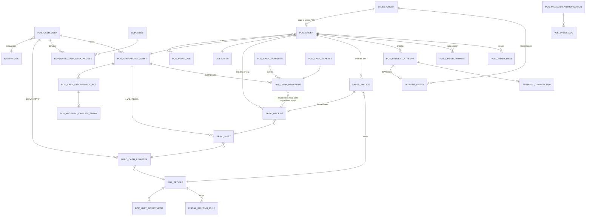

# 03 — Модель документів

## 1. Стандартні документи ERPNext, які використовуються

| Документ | Роль у POS | Примітка |
|---|---|---|
| Sales Invoice | обліковий продаж (`is_pos=1`, `update_stock=1`) і повернення (`is_return`, `return_against`) | створюється тільки сервером із POS Order; 1 POS Order → N SI (спліт по ФОП) |
| Sales Order | «Рахунок»/замовлення без списання; база резерву і передоплат | статуси оплати/поставки — стандартні |
| Quotation | комерційна пропозиція (опційно, поза касовим сценарієм) | фаза 5 |
| Payment Entry | передоплати за SO, підтверджені IBAN-надходження, повернення коштів | advance-механіка стандартна |
| Delivery Note | видача за рахунком, коли видача ≠ момент інвойсування | або SI з update_stock — рішення в 08 (питання №9) |
| Stock Entry / Material Request | переміщення між складами, запити на переміщення | |
| Stock Reservation Entry | резерв товару за Sales Order | |
| Item / Item Barcode / Item Group / UOM / Item Price / Price List | номенклатура, ШК, роздрібні ціни | пошуковий пріоритет — у POS API |
| Batch / Serial No / Serial and Batch Bundle | партії, терміни, серійні номери | FEFO-підказка — власна логіка |
| Pricing Rule / Promotional Scheme / Coupon Code | акції, промокоди | застосовуються сервером |
| Loyalty Program / Loyalty Point Entry | бонуси | POS — лише виклик |
| Customer / Customer Group | клієнти; системний «Роздрібний покупець» | |
| Mode of Payment (+custom fields) | способи оплати | `ua_pos_kind`: cash/card/iban/bonus/gift_cert/credit; `ua_payformcd` (код ПРРО); `ua_currency` |
| Company / Account / Bank Account / Cost Center | облік; Bank Account ↔ FOP Profile | фаза 1: одна Company |
| Accounting Dimension «FOP Profile» | ФОП-вимір у GL | fixtures |
| Employee | працівники, штрихкод/PIN-хеші (custom fields) | HRMS не потрібен |
| Currency / Currency Exchange | валюти і курси | джерело курсу — питання №12 |
| Print Format | офісні документи (вже є UA-формати) | чеки — ESC/POS шаблони, не HTML |
| File | фото підтвердних документів витрат | приватні файли |

**Не використовуються:** POS Invoice, POS Opening/Closing Entry, point_of_sale, POS Profile,
Cashier Closing (обґрунтування — 01 §2).

## 2. Custom DocType (module `ua_pos`, якщо не вказано інше)

Позначки: 🔒 — submittable/immutable після проведення, скасування лише через reversal;
📎 — child table.

### Конфігурація

**POS Cash Desk** — фізична каса.
Поля: назва; warehouse; company; профіль налаштувань (link); термінал (PB POS Terminal, optional);
чековий/офісний принтер (link POS Printer); дозволені ПРРО (child → PRRO Cash Register);
device_tokens (📎 зареєстровані станції: token_hash, hostname, active); статус.
Індекси: unique назва. Скасування: деактивація, не видалення (є історія).

**POS Cash Desk Profile** — повторно використовувані налаштування каси.
Поля: режим фіскалізації за замовч. (fiscal/non-fiscal/ask); дозвіл нефіскального режиму;
політика мінусового продажу (deny/warn+manager/allow); офлайн-ПРРО дозволено; multi-cashier;
дозволені валюти готівки (📎); дозволені Mode of Payment (📎); правила видимості чужих складів;
hotkey-профіль (JSON); ліміт днів перегляду історії касиром; поведінка мультиФОП-кошика
(block/split_prompt/auto_split/manager).

**Employee Cash Desk Access** — допуск працівника.
Поля: employee; cash desk; роль на касі (Касир/Старший касир/Менеджер); active; valid_from/to.
Індекси: unique (employee, cash_desk). Штрихкод — на Employee (`ua_pos_barcode_hash`, unique index).

**POS Printer** — принтер.
Поля: тип (receipt/office); підключення (network_escpos/cups/agent); host:port або cups-черга;
ширина стрічки; кодування; статус; desk-прив'язки.

**POS Settings** (single) — feature flags, глобальні політики, версії контрактів адаптерів,
системний клієнт «Роздрібний покупець», серії нумерації службових чеків.

### Управлінська каса

**POS Operational Shift** 🔒 — управлінська зміна.
Поля: cash desk; статус (див. 04 §4); responsible_employee; opened_by/at, closed_by/at;
opening/closing counts (📎 POS Denomination Count); очікувані/фактичні залишки по валютах
(📎 POS Shift Currency Summary: currency, opening, expected, counted, discrepancy);
handovers (📎: from_employee, to_employee, at, confirmed_by); зв'язки: PRRO Shifts (virtual, по полю),
discrepancy acts. Індекси: (cash_desk, status) — **partial-unique контроль «одна відкрита зміна на касу»
реалізується серверною валідацією + lock**. Immutable після закриття.

**POS Denomination Count** 📎 — покупюрний перерахунок.
Поля: context (opening/closing/transfer/expense/incasation); currency; denomination; qty; subtotal (обчисл.).
Мастер номіналів — **POS Currency Denomination** (currency, value, active).

**POS Cash Movement** 🔒 — єдиний журнал руху грошей (джерело правди для очікуваної готівки).
Поля: cash desk; operational shift; employee; direction (in/out); movement_type
(sale_cash / refund_cash / deposit / incasation_out / incasation_in / expense / transfer_out /
transfer_in / correction / opening_float); amount; currency; mode_of_payment; fop_profile (optional);
prro_receipt (optional — зв'язок з фіскальним службовим внесенням/видачею); basis_doctype+basis_name
(документ-підстава); is_cash_drawer (Check — чи впливає на фізичну скриньку); notes.
Правила: **одна фізична операція = один рух**; фіскальне службове внесення НЕ створює другого руху —
воно посилається на той самий Movement через `prro_receipt`. Безготівкові продажі створюють Movement
з `is_cash_drawer=0` (для звітів, не для залишку скриньки).
Індекси: (operational_shift, movement_type), (basis_doctype, basis_name), prro_receipt.
Cancel: заборонено; тільки reversal-рух з посиланням на оригінал.

**POS Cash Transfer** 🔒 — інкасація/передача між касами (двоетапна).
Поля: from_desk; to_desk (або «Центральна каса»); статус (Draft→Sent→Received / Disputed);
amount, currency; denominations (📎); sent_by/at; received_by/at; підстава; коментар.
On Sent → Movement(out) у джерела; on Received → Movement(in) у одержувача. Розбіжність при
прийманні → статус Disputed + акт. Гарантія «не двічі в залишках»: рухи створюються по одному
на кожен бік, обидва посилаються на один Transfer.

**POS Expense Category** — довідник категорій витрат (назва, рахунок обліку, вимагає_менеджера).

**POS Cash Expense** 🔒 — витрата з каси.
Поля: desk, shift, employee; категорія; одержувач; сума, валюта; коментар; документ-підстава;
attachment (фото); manager_authorization (link). On submit → Movement(out).

**POS Cash Discrepancy Act** 🔒 — акт розбіжності.
Поля: shift, desk, currency; expected, counted, discrepancy (+ надлишок / − недостача);
розрахунок (JSON-знімок формули); коментар касира (обов'язковий); manager_authorization;
liability_entry (link). Створюється автоматично при закритті зміни з розбіжністю.

**POS Material Liability Entry** — контрольований запис матеріальної заборгованості.
Поля: employee; act (link); сума; статус (Open/Approved/Settled/Written_off); затвердив; коментарі.
**Жодної автоматичної інтеграції з зарплатою** — лише ручний workflow (вимога ТЗ §4).

### Продаж (оркестрація)

**POS Order** 🔒 — saga-корінь продажу.
Поля: desk, shift, employee; customer (default «Роздрібний покупець»); режим (fiscal/non_fiscal);
статус (04 §1); items (📎 POS Order Item); payments_plan (📎 POS Order Payment); split-результат
(📎: fop_profile → sales_invoice, prro_receipt); routing_log (JSON: правила, що спрацювали, пояснення);
totals (сума, знижки, до сплати, отримано, решта); lookup_token (UUID, unique index) —
**штрихкод чека** (Code128 від токена; без персональних/фінансових даних; стабільний назавжди);
loyalty (баланс на момент, списано/нараховано); held (Check) + held_note; recovery_note;
idem_key (unique). Індекси: lookup_token, (desk, status), (shift), customer.
Immutable після Completed; скасування залежить від стану (04 §1).

**POS Order Item** 📎: item_code, назва, ШК (яким відсканували), артикул, qty, uom, price_list_rate,
rate (фактична), amount, discount_percent/amount/type (auto/loyalty/manual), manual_discount_auth (link),
warehouse, batch_no, expiry (знімок), serial_no, serial_skipped (Check + причина), fefo_override
(Check + причина), stock_check_status, коментар.

**POS Order Payment** 📎: mode_of_payment, kind, amount, currency, exchange_rate, fop_bank_account
(для IBAN), payment_attempt (link), status (planned/confirmed/failed/refunded).

**POS Service Receipt** 🔒 — службовий чек (мінусовий продаж та ін.).
Поля: серійний номер (naming series `SRV-.####`, безперервна нумерація); тип (negative_stock/…);
order/si link; товар, кількість, склад, залишок до/після; касир; причина; manager_authorization;
print_log (📎). Reprint — з позначкою, журналюється.

### Платежі

**POS Payment Attempt** 🔒 — спроба оплати (будь-який kind).
Поля: order; attempt_no; mode_of_payment/kind; amount, currency; статус (04 §2); idem_key (unique);
terminal_transaction (link); payment_entry (link, для IBAN/передоплат); error_code/text; resolved_by
(для ручного розв'язання unknown); timestamps. Індекси: (order, attempt_no) unique, idem_key unique.

**Terminal Transaction** 🔒 — журнал операцій ECR.
Поля: attempt (link); terminal (PB POS Terminal); operation (sale/refund/void/status/verify);
operation_id (unique); request/response (masked JSON); rrn; invoice_number; auth_code; card_mask;
статус (confirmed/declined/cancelled/timeout/unknown); reconciliation_status
(pending/matched/mismatch/manual); reconciled_with (link). Індекси: operation_id, rrn, (terminal, creation).

### Фіскальний шар (розширення `ua_fiscal` — власна апка, дозволено)

**PRRO Cash Register** (існує) + поля: cash_desk (link), active_for_desk.
**PRRO Shift** (існує) + поля: operational_shift (link), fop_profile (denormalized), opened_by_employee.
**PRRO Receipt** (існує — вже має UID-ідемпотентність, related_receipt, retry_count, offline, dps_response) +
поля: pos_order (link), payment_attempt (link), idem_key (unique), offline_session (link),
compensating_receipt (link, сторно/повернення), receipt_kind розширити:
(sale / return_full / return_partial / storno / service_in / service_out / open_shift / close_shift /
x_report / offline_begin / offline_end).
**PRRO Offline Session** — нова: register, начало/кінець, останній PREVDOCHASH, локальні номери,
статус вивантаження пакета (/pck), лічильники.
Інваріанти (серверні): один активний PRRO Shift на (register); заборона двох Delivered чеків з одним
pos_order+kind (unique index) — **захист від подвійної фіскалізації**.

### МультиФОП

**FOP Profile** (існує, `ua_fop`) + розширення: company (link, фаза N); bank_accounts (📎 → Bank Account);
allowed_item_groups (📎), denied_items (📎), allowed_modes_of_payment (📎), allowed_customer_groups (📎);
available_registers (virtual — з PRRO Cash Register); limit_warning_pct (default 80), limit_block_pct
(default 98); поточний ліміт — з UA Tax Parameters + income_monitor.

**Fiscal Routing Rule** — правило маршрутизації ФОП.
Поля: пріоритет (Int, менше = раніше); active; valid_from/to; тип (assign/allow/deny);
умови: desk, warehouse, mode_of_payment, item_group, item, customer_group, customer_type, час доби (опц.);
target fop_profile (для assign); allow_manual_override (Check); пояснення (шаблон, показується касиру).
Індекси: (active, priority). Оцінка: перше assign, що пройшло і не заборонене deny-правилами;
конфлікт (два позиції кошика → різні ФОП) → політика профілю каси (block/split/auto/manager).
Кожна оцінка пишеться у routing_log POS Order + POS Event Log.

**FOP Limit Adjustment** 🔒 — ручні коригування бази ліміту (сума, знак, причина, хто, документ).
**Джерело розрахунку використаної суми — виключно Z-звіти ПРРО** (рішення власника): Σ по PRRO Shift
`sales_total − refunds_total`, згрупованих по `fop_profile`, + FOP Limit Adjustment. IBAN/GL до бази
ліміту НЕ входять. Dashboard — report + number cards; кожна цифра прослідковується до конкретного Z-звіту.

### Контроль і журнал

**POS Manager Authorization** — одноразовий код менеджера.
Поля: менеджер (Employee/User); code_hash; action_type (manual_discount/negative_stock/expense/
fop_override/reprint/discrepancy/…); scope (order/сума-ліміт); TTL (default 5 хв); status
(issued/used/expired/revoked); used_at; used_by; used_in (doctype+name); причина.
Правила: код одноразовий, прив'язаний до дії і менеджера; ніяких універсальних кодів.

**POS Event Log** — append-only журнал POS-подій (вимоги ТЗ §20).
Поля: event_type (login/logout/failed_access/shift_open/shift_close/handover/fop_manual/
mode_change/price_override/manual_discount/manager_approval/negative_sale/serial_skipped/
batch_override/incasation/expense/discrepancy/return/storno/reprint/terminal_error/prro_error/
manual_fix/recovery); user; employee; desk; device_token_ref; ip; datetime; old_value/new_value (JSON);
причина; reference (doctype+name); manager. Індекси: (event_type, creation), (reference), (employee).
Заборона edit/delete на рівні permissions + `cannot_delete` hook.

**POS Print Job** — черга друку.
Поля: printer; job_type (fiscal_receipt/non_fiscal_receipt/service_receipt/cash_doc/warranty/
invoice/report/copy); payload_ref (doctype+name); формат (escpos/pdf); статус
(queued/printing/done/failed); attempts; is_copy (Check → маркування «Копія»); error. Ретраї воркером;
помилка друку **ніколи** не відкочує продаж.

### Пізні фази (спроєктовано, реалізація за flag)

**Gift Certificate**: номер/ШК (unique), тип (payment/prepayment), одно/багаторазовий, номінал,
залишок, валюта, строк дії, власник (пред'явник/персональний), fop_profile (емітент або shared),
статус (draft/active/partially_used/used/expired/blocked/refunded).
**Gift Certificate Transaction** 🔒: сертифікат, тип (issue/redeem/refund/transfer_liability),
сума, order/si, ФОП-джерело/одержувач зобов'язання.
**POS Credit Agreement**: клієнт, ліміт, строк, відповідальний, статус, погашення (📎), правила
фіскалізації. До погодження правил (08, питання №6–7) — не реалізуються.

### Оцінка списку з ТЗ §19

| Із ТЗ | Рішення |
|---|---|
| POS Cash Desk / Profile | ✅ custom (вище) |
| Employee Cash Desk Access | ✅ custom |
| POS Operational Shift / Denomination Count | ✅ custom |
| POS Cash Movement / Transfer / Discrepancy Act | ✅ custom |
| Fiscal Entity / FOP Profile | ✅ існуючий FOP Profile + розширення |
| Fiscal Routing Rule | ✅ custom |
| Fiscal Device | ✅ існуючий PRRO Cash Register |
| Fiscal Session | ✅ існуючий PRRO Shift + link на операційну зміну |
| Fiscal Operation Log | ✅ існуючий PRRO Receipt (розширений) — окремий лог не потрібен |
| POS Payment Attempt / Terminal Transaction | ✅ custom |
| POS Manager Authorization / Service Receipt | ✅ custom |
| POS Sale Lookup Token | ❌ окремий DocType не потрібен — unique-поле `lookup_token` на POS Order + resolver API (менше сутностей, той самий контроль) |
| FOP Limit Register | ❌ окремий регістр не потрібен — розрахунок з PRRO Receipt/PE + FOP Limit Adjustment (уникаємо подвійної бухгалтерії лімітів) |
| FOP Limit Adjustment | ✅ custom |
| POS Held Cart | ❌ не потрібен — статус Held у POS Order |
| Gift Certificate (+Transaction) | ✅ custom, фаза 6, feature-flag |

## 3. ER-діаграма (ядро)

## 4. Наскрізні правила цілісності

1. **Гроші**: очікувана готівка зміни по валюті = Σ Movement(is_cash_drawer=1) за зміну + opening_float.
   Формула ТЗ §4 виводиться з movement_type; безготівкові рухи маркуються is_cash_drawer=0.
2. **Фіскалізація**: unique(pos_order, receipt_kind, status=Delivered) + UID-ідемпотентність +
   стан-машина PRRO Receipt ⇒ подвійна фіскалізація неможлива структурно.
3. **Повернення**: сума повернутого по кожному mode ≤ сплаченого цим mode (перевірка по історії
   return-SI + PRRO Receipt kind=return); qty повернутого по позиції ≤ проданого.
4. **Термінал**: unique operation_id; при timeout — заборона нової спроби до status-запиту.
5. **Незмінність**: submittable-документи; on_cancel заборонений для Movement/Receipt/Attempt —
   тільки компенсація; hook `on_trash` блокує видалення журналів.
