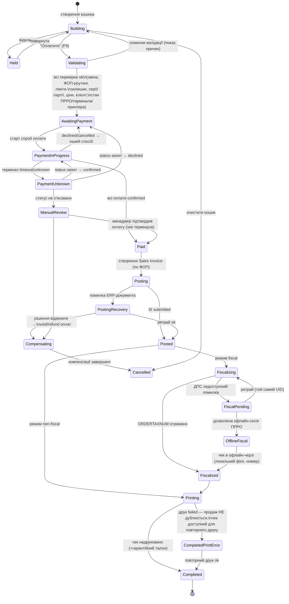
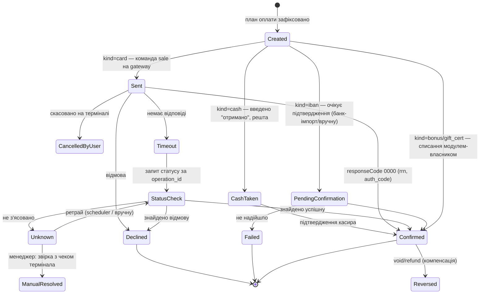
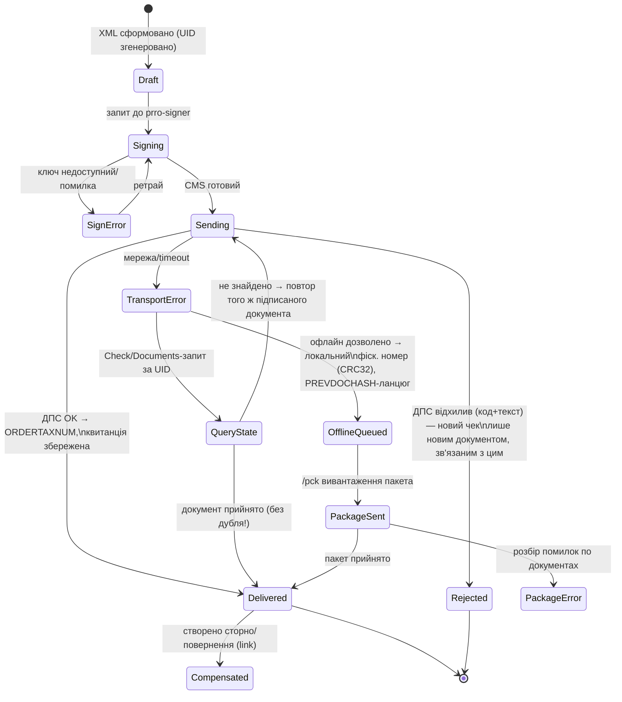
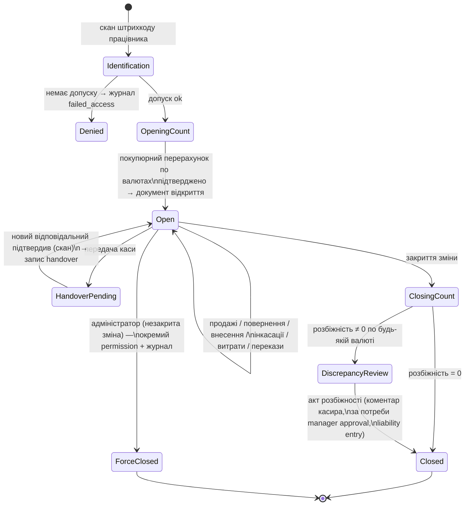

# 04 — Діаграми станів

Загальні правила для всіх машин:
- перехід виконується лише сервером, атомарно (`for_update` lock на документ);
- кожен перехід журналюється (state_history JSON + POS Event Log для чутливих);
- повтор запиту з тим самим idem_key повертає поточний стан без побічних ефектів;
- зі станів `*_Recovery` є і автоматичний (scheduler), і ручний (екран «Незавершені операції») вихід.

## 1. POS Order (продаж)

Ключові інваріанти:
- **повторне «Оплатити»** у будь-якому стані ≠ Building — повертає поточний стан (idem_key);
- **браузер закрився**: стан живе в БД; при вході касир бачить банер «незавершений продаж» і
  продовжує з того самого стану;
- продаж без фіскалізації **не може** бути fallback'ом стану FiscalPending — лише окрема дія
  «перевести в нефіскальний» з дозволом менеджера, журналюється (event `mode_change`);
- Cancel можливий тільки до Paid; після — лише через Compensating (void платежів) або повернення.

## 2. POS Payment Attempt (платіж)

Інваріанти: **заборона нової спроби**, поки існує спроба у Sent/Timeout/StatusCheck/Unknown;
у Unknown **ніколи** не запускається повторний sale (тільки status/verify); operation_id — unique.
Змішана оплата = кілька Attempt одного Order; Order переходить у Paid лише коли Σ Confirmed = до сплати.

## 3. PRRO Receipt (фіскальна операція)

Інваріанти: UID незмінний для документа — повтор надсилання завжди з тим самим підписаним
пейлоадом; перед повтором обов'язковий QueryState (перевірка результату) — це закриває
«втрату зв'язку після успішної фіскалізації» (сценарій 34); unique (pos_order, kind, Delivered).
Офлайн: ланцюг PREVDOCHASH (SHA-256) підтримується PRRO Offline Session; типи в одній зміні
не змішуються з тестовими.

## 4. POS Operational Shift (управлінська зміна)

Інваріанти: одна Open-зміна на касу; всі грошові операції вимагають Open-зміни цієї каси;
закриття блокується, якщо є POS Order у незавершених станах або відкриті PRRO Shift
(пропонується закрити Z-звітами або явно перенести — рішення менеджера, журналюється).

## 5. Повернення

```mermaid
stateDiagram-v2
    [*] --> Scanned : скан lookup-токена чека
    Scanned --> NotFound : токен не знайдено / період недоступний\nдля ролі → підвищений дозвіл
    Scanned --> Loaded : продаж знайдено — показ позицій,\nвже повернутого, оплат, ФОП, фіск. даних
    Loaded --> Selecting : вибір позицій/кількостей (≤ залишку до повернення)
    Selecting --> SerialCheck : суворі серійні товари → скан серійника,\nзвірка з первинним продажем
    SerialCheck --> Selecting
    Selecting --> RefundPlanning : розподіл повернення по способах оплати\n(≤ сплаченого кожним; алгоритм зміш. оплати —\nblocking question №4)
    RefundPlanning --> Validating
    Validating --> RefundInProgress : створення return-SI (is_return),\nсерійники → на склад / визначений статус
    RefundInProgress --> FiscalReturn : первинний продаж фіскальний →\nфіскальне повернення (ORDERRETNUM)
    RefundInProgress --> CashRefund : нефіскальний → нефіскальне повернення
    FiscalReturn --> MoneyOut : чек повернення Delivered
    CashRefund --> MoneyOut
    MoneyOut --> Completed : Movement(refund) / refund на термінал /\nсторно бонусів — друк документа
    Completed --> [*]
```

Правила: фіскальний продаж → тільки фіскальне повернення (і навпаки) — жорстка серверна заборона;
повернення завжди посилається на первинний POS Order/SI; часткові повернення акумулюються
(returned_qty на позиціях); обмін (за бізнес-правилом — лише нефіскальні) = зв'язана пара
«повернення + новий продаж» зі взаємними посиланнями (окремого документа не вводимо).

## 6. Сторнування: розведення операцій

| Ситуація | Операція | Документи |
|---|---|---|
| Кошик не оплачено | скасування кошика | POS Order → Cancelled |
| Оплата карткою пройшла, продаж не завершено | void на терміналі | Attempt → Reversed |
| SI створено помилково, фіскалізації не було | ERP cancel + reversal рухів | SI cancel, Movement reversal |
| Чек фіскалізовано, помилка виявлена одразу | фіскальне сторно (якщо підтримує протокол) або фіскальне повернення | PRRO Receipt kind=storno/return + return-SI |
| Продаж завершено, клієнт повертає | повернення (розділ 5) | повний ланцюг |

Кнопка «Сторно» в UI контекстна: показує лише допустиму для поточного стану операцію.
